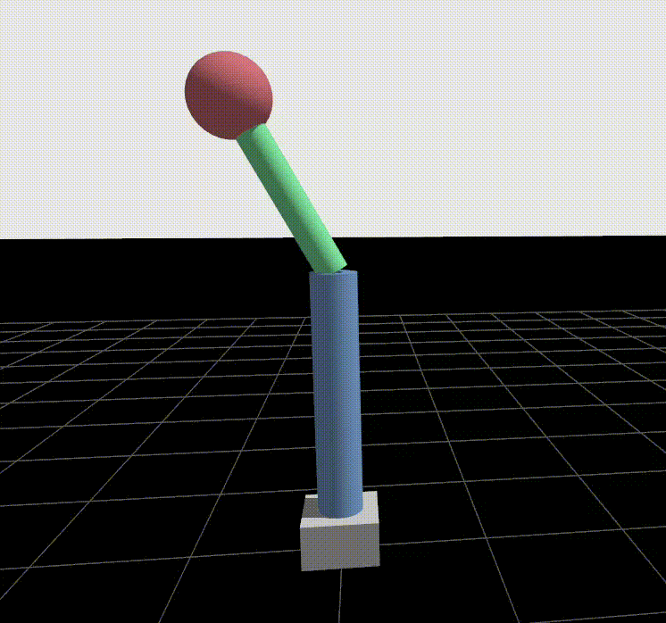

# arsmtrong-robot

## Overview

This project implements a simulation for 2-DOF robotics arm in ROS2 and Gazebo Environment with a simple PID Controller to control the arm movement.



This project is intended to complete the EL3015 Control System Course with the focus of implementing SISO control system.

## Project Structure

```
armstrong_robot/
├── armstrong_ws/                    # ROS2 workspace
│   └── src/
│       ├── armstrong_description/   # Robot URDF, meshes, Gazebo config
│       ├── armstrong_controller/    # Control algorithms & data acquisition
│       └── armstrong_bringup/       # Main launch configurations
├── matlab/                          # MATLAB analysis scripts (For System Identification, etc)
├── data_acquisition/                # More data & visualization on MATLAB
└── README.md
```

## Setup Instructions

### Install Requirements

To run the simulation, you'll need to install ROS2 and Gazebo Ignition on Ubuntu 22.04.

Also install MATLAB for System Identification and Controller Design with useful tools.

| Requirements | Description |
|-|-|
| Ubuntu 22.04 | [Install here](https://releases.ubuntu.com/jammy/) |
| ROS2 Humble | [Install here](https://docs.ros.org/en/humble/Installation.html) |
| Gazebo Ignition | [Install here](https://gazebosim.org/api/gazebo/6/install.html) |
| MATLAB | [Install here](https://www.mathworks.com/products/matlab.html) |

#### 1. Clone the repository
```
cd ~/colcon_ws/src # Replace this with your workspace
git clone https://github.com/goldwinsonick/armstrong_robot.git
```

#### 2. Build and source
```
cd ~/colcon_ws
source install/setup.bash # If using bash
```

## Usage Instructions

### Running the simulation

```
ros2 launch armstrong_bringup armstrong_simulated.launch.py
```
| Parameter | Description |
|-|-|
| lock_joint1 | (Default: False) Locks Joint1 (Arm to base) if true |
| use_teleop | (Default: False) Control the Robot's Joint using keyboard teleop |
| use_pid | (Default: False) Run PID Control based on target published to a topic |
| use_target | (Default: False) Run target for PID (Square Signal) |

For demo, you can run this launch script
```
ros2 launch armstrong_bringup armstrong_simulated.launch.py lock_joint1:=True use_pid:=True use_target:=True
```

### Running Specific Launch Files
You can use the main bringup launch. Alternatively, you can run the launch file that handles each specific task.

Each of these task can be configurable by modifying the yaml files specified below.

#### Running the simulation with teleop control

This launch handles the Robot Control using Keyboard Control.
Configuration file: [effor_teleop.yaml](./armstrong_ws/src/armstrong_controller/config/effort_teleop.yaml)

```
ros2 launch armstrong_bringup armstrong_controller teleop.launch.py
```

#### Running the PID Control

This launch handles the PID controller based on topic (example: /joint1_effort_controller/commands).

Configuration file: [joint_pid_params.yaml](./armstrong_ws/src/armstrong_controller/config/joint_pid_params.yaml).

```
ros2 launch armstrong_controller joint_pid.launch.py
```

#### Running Target Generation
This launch will generate target (A Square Wave) for testing the PID performance.

Configuration file: [joint2_target_publisher.yaml](./armstrong_ws/src/armstrong_controller/config/joint2_target_publisher.yaml)

```
ros2 launch armstrong_controller joint2_target_publisher.launch.py
```

#### Data Acquisition
This launch will records the joint state for a specific period.

Configuration file: [oltf_data_acq.yaml](./armstrong_ws/src/armstrong_controller/config/oltf_data_acq.yaml)
```
ros2 launch armstrong_controller oltf_data_acq.launch.py
```